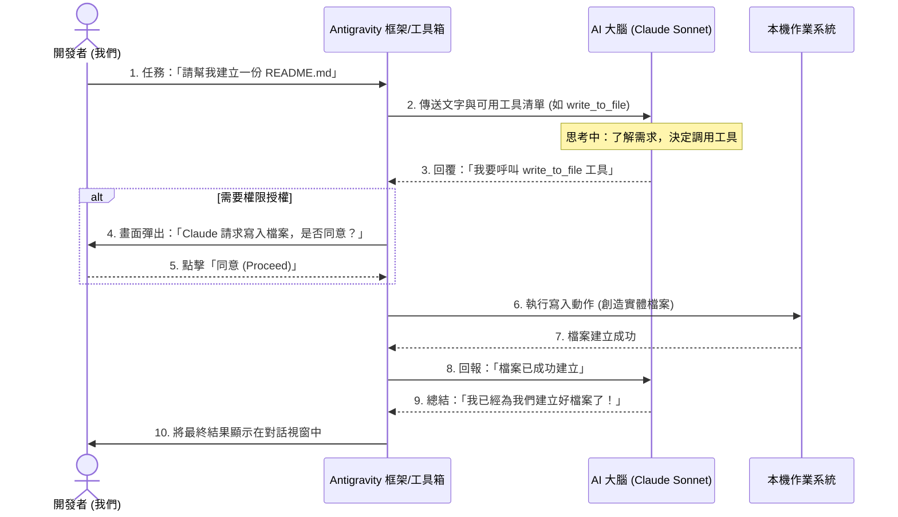

延續前篇探討的「多帳號開發工作流」，你可能會好奇：如果我特別偏愛 Claude 的程式碼風格，難道只能在網頁版來回複製貼上，或是開著 Claude 桌面版（Desktop）與編輯器在兩個 App 之間頻繁切換操作嗎？能不能讓 Claude 直接且無縫地操控我的本機開發環境？

答案是肯定的！本文將帶你一窺現代 AI 開發環境的底層機制，圖解如何將「最聰明的 AI 大腦」完美封裝進「安全的本機執行框架」中。

---

## 一、 抽換大腦：當 Antigravity 遇上 Claude

在 Antigravity 這樣的 Agent 平臺系統中，我們可以隨時從介面上切換驅動系統的大語言模型（LLM）。當我們在選單中選擇 `Claude Sonnet 4.6` 時，發生了什麼事？

簡單來說：**Antigravity 提供了「手與腳（操作本機的工具與權限）」，而 Claude 則成為了「大腦（思考邏輯與決策）」。**

這種結合帶來了極大的優勢：
1. **無縫結合**：我們的每一個指令都會直接送給 Claude 思考，再由 Claude 控制 Antigravity 的工具來幫我們寫本機檔案。
2. **無雙重消耗**：這是一次性的 API 請求，完全不會浪費 Token，只會消耗系統中該模型對應的配額，也就是說，我們不需要先讓某個模型做初步規劃，再手動把結論丟給另一個模型實作、讓它重新瞭解情境；在這裡，我們可以直接順著脈絡接續進行。
3. **依任務彈性調整**：它的優勢是可以藉由這個平臺，隨著任務調整我們想要的模型。也就是說，不會先從 Gemini 解析我們的要求，然後才發現要再調用 Claude Sonnet 進行任務。

---

## 二、 一張圖看懂 Agent 的運作流程

為了讓這個概念更具象化，我們來看看當我們輸入「請幫我建立一份 README.md」時，底層到底發生了什麼事：

從上圖可以清楚看到，AI 大腦（Claude）並沒有能力直接竄改我們的電腦，它必須向框架提出「請求」，而最終的生殺大權（授權）始終掌握在我們手中。這是目前最安全也最高效的協作模式。

---

## 三、 三種介面，同一個靈魂 (CLI、IDE、Desktop App)

了解了核心引擎後，我們再來看看 Antigravity 提供的三種操作介面。其實，它們背後共用的是完全相同的 Agent 引擎，唯一的差別在於**「我們與它互動的介面形式 (UI)」**，適合不同的開發情境：

1. **Antigravity IDE (IDE 編輯器)**
   * **特點**：完整的開發環境，將 AI 對話框、檔案總管與程式碼編輯區全部整合在同一個視窗。
   * **最佳情境**：**高強度的深度開發**。一邊看著 AI 直接修改程式碼，一邊手動微調與即時預覽。
2. **Antigravity.app (Mac 獨立桌面版)**
   * **特點**：專注於 AI 對話與遙控的獨立 Desktop App 介面，乾淨俐落。（這在使用體驗上，可以直接對標 Claude 的 Desktop App）
   * **最佳情境**：**雙螢幕或多視窗協作**。適合在一個乾淨的獨立視窗中與 AI 討論架構（例如使用 `/grill-me` 進行互動式問答）、下達指令，而我們可以使用自己原本習慣的編輯器（如原本的 VS Code）來檢視專案。這也是「動口不動手」遙控本機專案的最佳利器。
3. **Antigravity CLI (終端機命令列)**
   * **特點**：純文字介面，直接在 Terminal 下指令溝通。（這在定位上，可以直接對標官方的 Claude Code CLI 工具）。
   * **最佳情境**：**自動化與快速除錯**。在終端機跑測試遇到報錯時，不想切換視窗，直接敲指令讓 AI 幫忙分析與修復。

這就像是同一套超強的「智慧管家系統」，為我們提供了三種不同層級的操作武器。我們可以依照當下的開發心情與螢幕配置，無縫切換使用！

